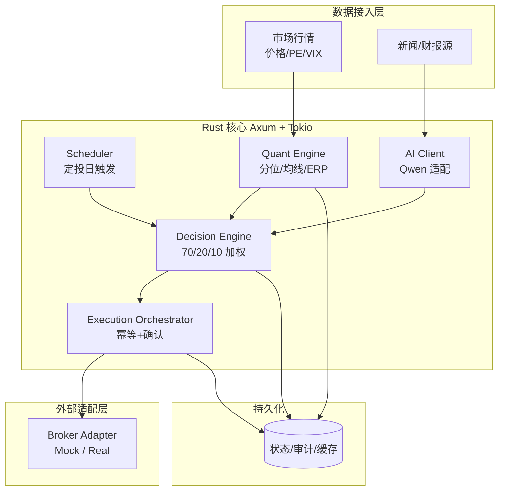

<p align="center">
  
</p>

<p align="center">
  <a href="./readme.en.md">English</a> | 中文文档
</p>

<p align="center">
  <a href="https://github.com/jamesra26/indexlink/blob/main/Cargo.toml"></a>
  <a href="https://github.com/jamesra26/indexlink/releases"></a>
  <a href="https://opensource.org/licenses/MIT"></a>
  <a href="https://github.com/jamesra26/indexlink"></a>
</p>

<p align="center">
  <a href="https://www.rust-lang.org/"></a>
  <a href="https://doc.rust-lang.org/cargo/"></a>
  <a href="https://github.com/jamesra26/indexlink"></a>
  <a href="https://github.com/jamesra26/indexlink/tree/main/crates"></a>
</p>

<p align="center">
  <a href="https://conventionalcommits.org"></a>
  <a href="./CHANGE_LOG.md"></a>
  <a href="./AGENTS.md"></a>
</p>

<p align="center">
  <a href="https://github.com/jamesra26/indexlink/stargazers"></a>
  <a href="https://github.com/jamesra26/indexlink/commits/main"></a>
  <a href="https://github.com/jamesra26/indexlink/graphs/commit-activity"></a>
</p>

<p align="center">
  <a href="https://github.com/jamesra26/indexlink/issues"></a>
  <a href="https://github.com/jamesra26/indexlink/pulls"></a>
  <a href="https://github.com/jamesra26/indexlink/graphs/contributors"></a>
</p>

<p align="center">
  <a href="https://github.com/jamesra26/indexlink/issues">Issue Tracker</a> •
  <a href="./LICENSE">License</a> •
  <a href="./CHANGE_LOG.md">Changelog</a>
</p>

IndexLink 是一个为长期指数投资者设计的智能定投执行系统。它通过 **“历史分位锚点 + AI 语义感知”** 双引擎，在定投日进行微调：相对低位多投、相对高位减投、过热延时。

> **核心前提：** 我们无法判断市场是否「低估」，但可以用数据检测它在历史分布中所处的「位置」。IndexLink 只测量位置，不声称知道价值——这是「自适应定投」与「择时投机」的本质区别。

---

## 核心哲学

传统的定投（DCA）在极端行情下存在僵化问题。IndexLink 的存在是为了解决：

- **处于历史高位区间时仍机械全量买入：** 当 P/E 处于历史 90% 分位且情绪过热时，自动触发“延迟”或“减量”。
- **处于历史低位区间时金额未随位置自适应：** 当价格 / ERP 分位处于历史低位区间时，自动建议/执行适度加码。
- **利好出尽的陷阱：** 结合财报季预期差与宏观新闻，识别“虚假繁荣”。

---

## 决策模型：70/20/10 法则

系统拒绝“盲目 AI 幻想”，每一笔指令都基于以下加权逻辑：

| 维度                       | 权重    | 核心指标                             | AI 的角色                                                   |
| :------------------------- | :------ | :----------------------------------- | :---------------------------------------------------------- |
| **历史位置 (Fundamental)** | **70%** | P/E Ratio (Shiller), ERP, 历史分位点 | **硬约束**：计算当前价格在历史分布中所处的分位。            |
| **近期趋势 (Technical)**   | **20%** | 200日均线距离, RSI, 波动率 (VIX)     | **节奏控制**：判断是否处于“接飞刀”或“赶顶”状态。            |
| **语义感知 (Sentiment)**   | **10%** | 财报预期差、宏观新闻、用户自定义源   | **软微调**：通过 Qwen 识别新闻/机构评级调整背后的逻辑偏向。 |

---

## 关键功能

- 🤖 **Qwen 决策引擎**：负责阅读本周核心财经新闻及财报指引，识别预期差。
- 🦀 **Rust 生产级后端**：使用 Rust (Axum + Tokio) 保证任务调度的高可靠性，确保金融指令在预定时间准确触发。
- 📊 **动态动作空间**：
  - **Overweight (+20~50%)**：处于历史低位区间且未在极端急跌中时，定投纪律内适度加码。
  - **Standard (100%)**：处于历史中性区间（约 30%~70% 分位）时稳健执行。
  - **Tactical Delay**：因重大新闻（如非农、议息）或技术过热建议延迟 3-5 天。
  - **Underweight (-50%) / Skip**：处于历史高位区间或系统性风险时缩量或观望。
- 💰 **双桶现金池**：执行层引入副桶（持有短债等无风险资产）消除现金拖累；倍率低于 1 时差额存入副桶，倍率高于 1 时动用副桶补足加码资金；现金流策略（守恒 / 弹性）可配置。
- 🔌 **自动化交易接口**：支持 Mock 模式与真实券商 API (Broker Adapter)，实现从决策到成交的端到端闭环。
- 📜 **透明审计日志**：每一笔订单自动生成一份《AI 决策存证》，详细解释为何做出该调整。

---

## 技术架构

### 设计原则

1. **确定性优先，AI 受限**：70% + 20% 为纯函数式、可复现的计算；10% 的 AI 仅在有界区间内微调。AI 不可用时自动降级为 90/10/0，系统照常运行。
2. **位置语言贯穿数据模型**：核心输出是历史分位而非价值判断。
3. **金融可靠性三件套**：**幂等**（同一定投日不重复下单）、**审计**（每笔决策可回放）、**熔断**（异常时默认 Skip 而非乱投）。
4. **决策与执行分离**：决策计算与下单是两个阶段，中间可插入用户确认。

### 分层总览



### 模块职责

| 模块                       | 权重      | 职责                                                                                            |
| :------------------------- | :-------- | :---------------------------------------------------------------------------------------------- |
| **Scheduler**              | —         | 基于 Tokio + 持久化任务表触发定投日决策；幂等键，进程重启不丢任务。                             |
| **Quant Engine**           | 70% + 20% | 将所有指标转为「在自身历史分布中的**指数加权分位**」；以半衰期为唯一旋钮（默认 36 个月月度数据），消除硬窗口的「幽灵跌落」效应；纯函数，无 IO，实盘与回测共用。 |
| **AI Client**              | 10%       | 封装 Qwen，输出有界情绪偏移 `sentiment ∈ [-1, +1]`；超时/解析失败即返回 0（降级）。             |
| **Decision Engine**        | —         | 按 70/20/10 合成综合得分，映射为定投倍率，输出含输入快照的 `Decision`。                         |
| **Execution Orchestrator** | —         | 决策 →（可选）用户确认 → 幂等下单；状态机 `Pending→Confirmed→Submitted→Filled/Failed/Skipped`。 |
| **Broker Adapter**         | —         | 一个 trait，两个实现：`MockBroker`（回测/演示）与 `RealBroker`（实盘）。                        |

### 决策管线

```text
综合得分 S = 0.70 * f_value(加权分位)        // 历史位置，主导
          + 0.20 * f_trend(均线/RSI/VIX)  // 节奏
          + 0.10 * sentiment              // AI 有界微调

倍率 multiplier = clamp( map(S), 0.0, x )   // 上限x为用户决定，下限 Skip
```

- **历史位置**使用**指数加权 ECDF**：权重 $w_k = (1-\alpha)^k$，$\alpha = 1 - 0.5^{1/H}$，$H$ 为半衰期（默认 36 个月月度数据）。越近的样本权重越高，滞后 $H$ 处权重恰好衰减至 $0.5$；无分布假设，输出仍为 `[0, 1]` 分位，天然消除硬窗口的「幽灵跌落」效应。
- **低位但急跌**时，`f_trend` 给出负向修正，体现「不接飞刀」——加码更保守。
- `clamp` 是硬安全边界：无论 AI 如何输出，倍率永远落在 `[0, 1.5]`。
- 动作（Overweight / Standard / Delay / Underweight / Skip）只是倍率所在区间的标签。

### 双桶现金池（Two-Bucket Execution）

执行层引入副桶（Buffer Bucket，持有短债等无风险资产）消除现金拖累，并联动倍率 $M$ 进行资金调度。副桶是**定投弹药缓冲池**，不是独立投资仓位：往里存是「暂缓投入」，从里取是「兑现此前的计划」，系统从不主动择时卖出。

**四条核心规则**

1. **副桶是弹药缓冲池**：资金最终目的地始终是主桶（主标的）；「从副桶取出」= 完成此前缓存的定投指令，不构成择时卖出。
2. **取出量受余额约束**：实际从副桶划出金额 = min（理论补足额, 副桶当前余额）；余额不足时按可配置策略处理（见下方）。
3. **副桶设累积上限**：上限为基准金额的若干倍（默认 3 倍）；超出上限的累积金额直接买入主桶，避免副桶意外堆成大仓位。
4. **现金流策略可配置**：

| 策略 | 副桶余额不足时的处理 | 适合场景 |
| :--- | :--- | :--- |
| `Conservative`（默认） | 按实际余额部分执行，审计日志标注「弹药不足，部分执行」 | 严格限制单期现金流、收入不稳定 |
| `Aggressive` | 从当期额外现金流补足缺口，保证倍率完整执行 | 愿意在信号强时多投、收入稳定 |

**资金流示意**（$M$ = 决策倍率，$B$ = 基准金额）

```text
M < 1：主桶买入 B×M，差额 B×(1-M) 存入副桶（若副桶未满）
M = 1：主桶全额买入 B，不操作副桶
M > 1：主桶买入 B×M；超出部分 B×(M-1) 来自副桶（受余额约束）
```

> 双桶逻辑完全属于执行层（`Execution Orchestrator`），与决策数学解耦——`Decision` 只输出倍率 $M$，双桶在倍率之后才介入，不污染无 IO 的 `decision` / `quant-engine` crate。

### 工程结构（Cargo Workspace）

```text
indexlink/
├─ crates/
│  ├─ core-domain/      # 数据结构: Decision, Action, Percentile (无 IO)
│  ├─ quant-engine/     # 70%+20% 纯函数计算 (无 IO)
│  ├─ ai-client/        # Qwen 适配 + 降级逻辑
│  ├─ decision/         # 70/20/10 合成 + 映射函数
│  ├─ broker/           # Broker trait + Mock/Real 实现
│  ├─ scheduler/        # Tokio 持久化调度
│  ├─ storage/          # DB 访问 (审计/状态/缓存)
│  └─ api/              # Axum HTTP 层 (确认/查询/手动干预)
└─ apps/
   └─ server/           # 组装各 crate 的可执行入口
```

> 将 `quant-engine` / `decision` 设计为无 IO 的纯逻辑 crate，使**实盘与回测共用同一份决策代码**，是本架构的关键。

### 持久化与审计

| 数据表         | 用途                                                    |
| :------------- | :------------------------------------------------------ |
| `plans`        | 定投计划（标的、周期、基准金额、风险参数）              |
| `decisions`    | 每次决策 + **输入快照** + 理由（《AI 决策存证》落地处） |
| `orders`       | 订单状态机 + 幂等键                                     |
| `market_cache` | 行情/指标缓存，保证当日可复现                           |

> 审计原则：**存输入而非只存结论**——保存当时的分位、趋势、sentiment 与权重，事后才能回答「为何那天加码 30%」。

### 可靠性与安全

- **幂等**：`(plan_id, as_of_date)` 唯一约束 + 下单幂等键，杜绝重复成交。
- **熔断 / Kill Switch**：数据缺失或 Broker 报错时默认 **Skip**，不确定时绝不乱投。
- **降级链**：AI 挂 → 90/10/0；行情源挂 → 用缓存或跳过当日；Broker 挂 → 重试后转人工。
- **金额安全**：硬编码倍率上限 + 单日金额上限，AI 无法突破。
- **人工干预**：Axum 提供确认 / 否决 / 手动覆盖接口，每次干预均进审计。

### 分阶段落地

1. **MVP**：`core-domain` + `quant-engine`（仅 70%，使用指数加权 ECDF，半衰期 36 个月）+ `MockBroker` + 本地回测，验证加权分位驱动的自适应定投。
2. **加节奏**：接入 20% 趋势 + 熔断。
3. **加 AI**：接入 Qwen 的 10% 有界微调 + 降级。
4. **上调度与执行**：持久化 Scheduler + 幂等下单 + 审计日志 + 双桶执行策略（`Conservative` / `Aggressive` 可配置）；为纯数据结构补充 feature-gated `serde` 支持，用于落地输入快照、`decisions` 审计存证与当日复现。
5. **接实盘**：实现 `RealBroker` + 人工确认流。

> `serde` 仅提供数据编码/解码能力，不引入 IO；对 `Percentile`、`Multiplier` 等带不变量的 newtype，反序列化必须复用构造校验，避免绕过安全边界。

---

## 免责声明

> **本项目仅供学习与技术研究之用，不构成任何投资建议。**

- **非投资建议**：IndexLink 输出的所有决策、倍率与信号仅为基于历史数据的量化计算结果，不代表任何买卖推荐，也不预测市场涨跌。
- **不保证收益**：指数投资存在本金亏损风险，历史分位与回测表现均**不预示**未来收益。任何依据本系统做出的投资决策，盈亏由使用者自行承担。
- **自适应 ≠ 择时**：本系统只测量价格在历史分布中的「位置」，**不声称**判断市场「低估 / 高估」，更无法保证「买在低点」。
- **风险自负**：在接入真实券商 API 进行实盘交易前，请充分理解代码逻辑与潜在风险，并自行进行充分测试。作者不对因使用本软件造成的任何直接或间接损失负责。
- **合规提醒**：自动化交易可能受所在国家/地区法律法规及券商条款约束，使用前请确认合规性。

---

## 后端基础设施（第一阶段）

当前后端默认使用本地 SQLite 文件，已提供 HTTP 服务、启动 migration、健康检查、就绪检查、结构化日志、优雅停机和持久化 Docker Compose 数据卷。旧 PostgreSQL adapter 仍保留为兼容实现，但不再是 MVP 运行时依赖。

### 本地启动

1. 安装当前 stable Rust 工具链以及 `rustfmt`、`clippy`。
2. 复制示例配置并启动服务。首次启动会自动创建本地 SQLite 文件并执行 migration：

   ```bash
   cp .env.example .env
   cargo run -p indexlink-server
   ```

3. 验证服务：

   ```bash
   curl http://localhost:8080/health
   curl http://localhost:8080/ready
   ```

`.env` 仅供本地使用且已被 Git 忽略。主要环境变量如下：

| 变量 | 默认示例 | 说明 |
| :--- | :--- | :--- |
| `APP_HOST` | `0.0.0.0` | HTTP 监听地址 |
| `APP_PORT` | `8080` | HTTP 监听端口 |
| `RUST_LOG` | `info,indexlink_server=debug` | 日志过滤规则 |
| `DATABASE_URL` | `sqlite://indexlink.db?mode=rwc` | SQLite 文件地址；未设置时使用该本地默认值 |
| `CORS_ALLOWED_ORIGINS` | `http://localhost:3000` | 逗号分隔的允许来源 |
| `DATABASE_MAX_CONNECTIONS` | `10` | 连接池上限 |
| `DATABASE_CONNECT_TIMEOUT_SECONDS` | `5` | 启动连接超时秒数 |

### Docker Compose

Compose 会使用名为 `sqlite-data` 的本地 Docker volume 保存数据库；执行 `down` 不会删除该数据，若需要清空演示数据请显式删除该 volume。

```bash
docker compose -f deployment/docker-compose.yml up --build -d
docker compose -f deployment/docker-compose.yml ps
docker compose -f deployment/docker-compose.yml down
```

### 基础端点

- `GET /health`：只检查服务进程是否存活，不访问数据库。
- `GET /ready`：执行 SQLite 存活检查；数据库不可用时返回 HTTP `503` 和不含内部错误的统一 JSON 响应。
